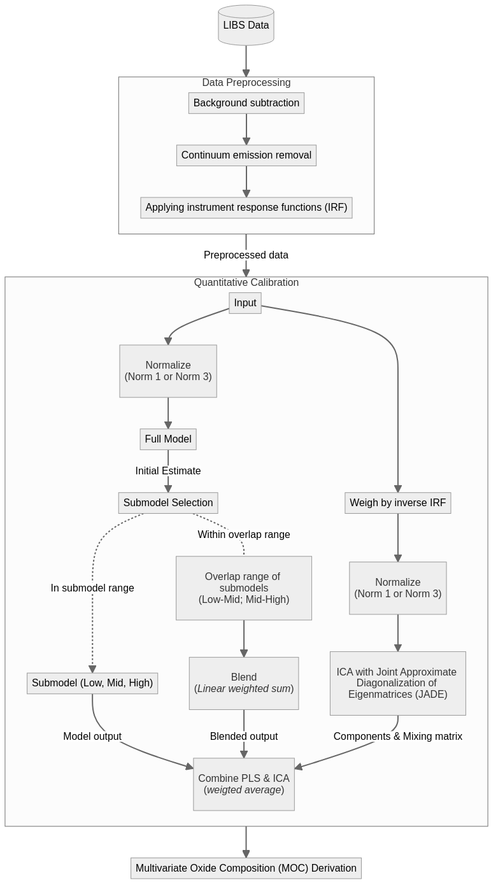

# P9 Project: Report Pre-Thesis

This is a technical report acting as the 'pre-thesis' for our thesis. It represents our work during the 9th semester, which will be followed by the actual thesis in the 10th semester.

## Pipeline diagram

To get a better understanding of the current pipeline used for ChemCam calibrations, we have created a diagram of the pipeline.

Any edits to the pipeline should be reflected in `pipeline.mmd` using [mermaid.js](http://mermaid.js.org) syntax.

To 'build' the pipeline, run the following command in the terminal:

```bash
# pnpm install # - if you haven't already. Need the mermaid-cli package.
pnpm run pipeline
```

This will generate a file called `pipeline.png` in the `src/images` folder. The pipeline is shown below:

